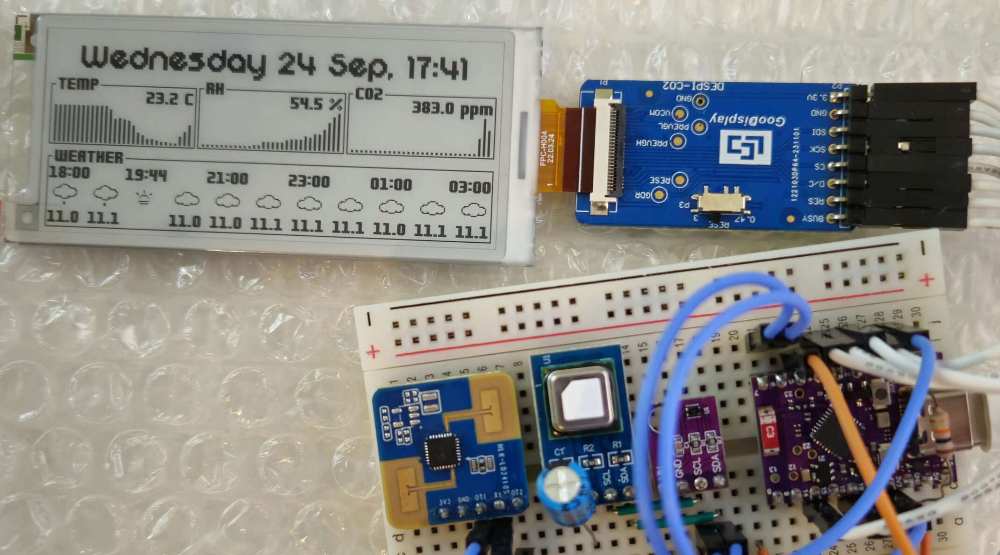

# E-paper dashboard

A low-power e-paper dashboard for displaying everyday quick infos and collecting indoor air quality data.

## Features

- Date and time clock
- 10-hour weather forecast fetched from open-meteo.com
- Aesthetic but simple GUI
- High accuracy indoor air quality sensors from Sensirion: temperature, relative humidity and CO2 sensors.
- Lazy refresh: the epaper screen refreshes only when the human radar sensor detects presence
- Background data collection: the ESP32C6's ULP collects sensors data while the HP is in deep sleep to save power

## Hardware

- ESP32C6 (Super mini dev board)
    - Wireless connectivity: Wi-fi 6, 802.15.4
    - RISC-V Ultra Low Processor (ULP) featuring a LP I2C peripheral
- Sensors
    - SHT41 as a high accuracy and simple-to-use temperature (±0.2°C typ) and relative humidity (±1.8% typ) I2C sensor
    - SCD41 as a compact "cheap" but accurate I2C CO2 sensor with a range from 400 to 5000ppm and low-power measurement options
    - LD2410s as a UART low-power millimeter wave human radar with a stationary detection range of 4m
- User Interface
    - GDEY029T71H: 2.9" high-resolution SPI epaper display from Good Display (soon to be replaced with a bigger screen) using the SSD1685 controller
    - Heartbeat LED: notifies the user that the device is powered on and collecting measurements

Currently, every part is a breakout board, but in the future, I want to design a PCB to accomadate everything.

## Software

This project is a challenge for me: I want to improve my design and low-level programming skills by doing everything by myself.
Thus, no external library except ESP IDF is allowed.

The firmware is in C using features from the C11 standard (notably \_Generic) to help make the interfaces convinient and safe (yes, it is possible in C).
I try to come up with cool tricks to do parameter validation at compile time, when possible, in public drivers API and to prevent the representation of illegal states trough clever type and interface design.

Here is a small summary of the different ESP IDF components I coded from scratch:
- [sht4x](components/sht4x): Driver for the SHT4x sensor family designed to run on both HP and ULP
- [scd4x](components/scd4x): Driver for the SCD4x sensor family designed to run on both HP and ULP
- [ld2410s](components/ld2410s): Driver for the human radar designed to be convinient and easy to use
- [ssd1680](components/ssd1680): A framebuffer-based SPI display driver for the SSD16x epaper controller family
- [bitui](components/bitui): bitmap primitive graphics library supporting the specific pixel format used by the SSD168x
- [immjson](components/immjson): JSON deserialization library designed to parse a stream of data (no copy of the whole JSON) and deserialize it to a struct
- [gui](components/gui): The dashboard's UI supporting several screens, text and icon rendering including a hot-reloadable SDL2 backend for quick prototyping (see `simu/`)

## TODO

- [ ] Add support for the bigger 3.97" epaper display GDEM0397T81P
- [ ] Add transportation timetable GUI widget
- [ ] Error UI screen
- [ ] Schematic and PCB
- [ ] 3D printed case

## License

All the project's files are licensed under the [GPL v3](LICENSE).
